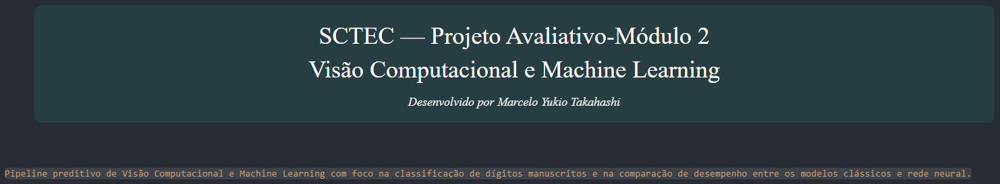

# 🧠 PixelMind: Classificação de Imagens & Machine Learning


> **PixelMind** é um pipeline preditivo ponta a ponta de Visão Computacional e Machine Learning focado na classificação de dígitos manuscritos (*MNIST dataset*). O projeto explora a transição da extração de matrizes de pixels para modelos estatísticos clássicos e redes neurais profundas, incluindo testes rigorosos com imagens próprias ✍️🎨

---

## 📌 Sumário
- [🎯 Objetivo do Projeto](#-objetivo-do-projeto)
- [🛠️ Ferramentas & Tecnologias](#️-ferramentas--tecnologias)
- [📂 Estrutura do Repositório](#-estrutura-do-repositório)
- [🚀 Fluxo do Pipeline & Fases](#-fluxo-do-pipeline--fases)
- [📊 Modelos e Resultados Obtidos](#-modelos-e-resultados-obtidos)
- [🧪 Teste Extremo (Imagens Próprias - Out of Distribution)](#-teste-extremo-imagens-próprias---out-of-distribution)
- [🏁 Como Executar o Projeto](#-como-executar-o-projeto)
- [📹 Vídeo explicativo](#-demonstração-e-explicação-em-vídeo)
- [🧑🏻‍💻 Desenvolvedor](#autor)

---

## 🎯 Objetivo do Projeto

O **PixelMind** busca comparar e avaliar o desempenho de algoritmos de **Machine Learning Clássico** vs. **Redes Neurais Artificiais** na tarefa de reconhecer caracteres e dígitos manuscritos. 

Além disso, o projeto estressa os modelos treinados submetendo-os a imagens reais capturadas manualmente (fora da distribuição do MNIST), avaliando pré-processamento digital de imagens, centralização de massa, inversão de escala e resiliência de inferência.

---

## 🛠️ Ferramentas & Tecnologias

O projeto foi desenvolvido em **Python 3.11+** utilizando bibliotecas consolidadas do ecossistema de Ciência de Dados:

| Categoria | Tecnologias Utilizadas |
| :--- | :--- |
| **Linguagem & Ambiente** | `Python`, `Jupyter Notebook` / `VS Code` |
| **Manipulação & Análise** | `NumPy`, `Pandas` |
| **Visão Computacional & Imagem** | `OpenCV`, `Pillow (PIL)`, `Matplotlib`, `Seaborn` |
| **Machine Learning Clássico** | `scikit-learn` *(Random Forest e KNN)* |
| **Deep Learning** | `TensorFlow` / `Keras` *(MLP)* |

---

## 📂 Estrutura do Repositório

```text
pixel-mind/
│
├── 📁 data/                  # Imagens desenhadas à mão (.png)
│
├── 📁 imagem/                # Imagem para o link do video
│   └── video.png
│
├── .gitignore                # Arquivos ignorados pelo Git
├── pixel_pipeline.ipynb      # Arquivo com o código
├── README.md                 # Documentação principal do projeto
└── requirements.txt          # Dependências do projeto para reprodutibilidade
```
--- 

## 📊 Modelos e Resultados Obtidos

Modelo | Hiperparâmetros  | Ajustados Acurácia (Teste) | F1-Score (Macro)  
|---------|------------|----------------------|----------------
KNN  | n_neighbours=5, weights='distance' | 0.9703 | 0.9703
Random Forest   | n_estimators=100, max_depth=20 |  0.9648 |  0.9648 
Rede Neural (MLP) | Dense(128/64, relu) + learning_rate=0.001 | 0.9751 | 0.9751

---

## 🧪 Teste Extremo: Imagens Próprias (Out of Distribution)
Nesta etapa, validamos a generalização dos modelos usando dígitos escritos à mão em papel e fotografados:  

Amostra Real  | Dígito Real | Predição do Modelo | Probabilidade | Status  
|-------------|-------------|--------------------|---------------|-------  
✍️ Amostra A | 4 | 4 | 99.1% | ✅ Sucesso   
✍️ Amostra B | 4 | 4 | 80.0% | ✅ Sucesso 
✍️ Amostra C | 7 | 2 | 91.5% | ❌ Erro 

Em nosso experimento o modelo conseguiu identificar corretamente duas das três amostras.  
Sendo que na segunda amostra o modelo errou 18.4% confundindo o número 4 com o número 9 e na terceira amostra o modelo identificou o número 7 sendo o 2 com 91.5% de certeza.  
Apesar do erro, isto demonstra uma boa performance do modelo de rede neural.

---
## 🏁 Como Executar o Projeto
Clone este repositório:

```Bash
git clone https://github.com/MYTakahashi/pixel-mind.git
cd pixel-mind
```
```Bash
Crie e ative um ambiente virtual:
python -m venv venv
# Windows:
venv\Scripts\activate
# Linux/Mac:
source venv/bin/activate
```
```Bash
Instale as dependências necessárias:
pip install -r requirements.txt
```
```Bash
Execute o notebook:  
jupyter notebook pixel_pipeline.ipynb
```
## 🎥 Demonstração e Explicação em Vídeo

O vídeo explicativo detalhando os objetivos do sistema, a organização das tarefas, os desafios enfrentados e a tomada de decisões técnicas está disponível no link abaixo:
<p align="center">
    <a href="https://drive.google.com/file/d/18oSvRLT7pvU-CKVm_ydiwOxx-MMuLE3-/view?usp=drive_link">
    
    </a>
    <br>
    <em>Clique na imagem para assistir à apresentação deste projeto.</em>
</p>

---

# Autor

**Marcelo Yukio Takahashi**

Engenheiro Eletricista

Especialista em Projetos e Manutenção

Analista e Ciêntista de Dados

---
